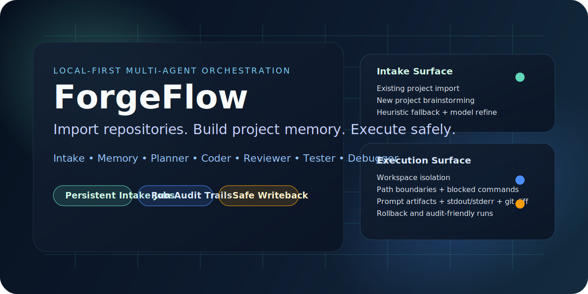
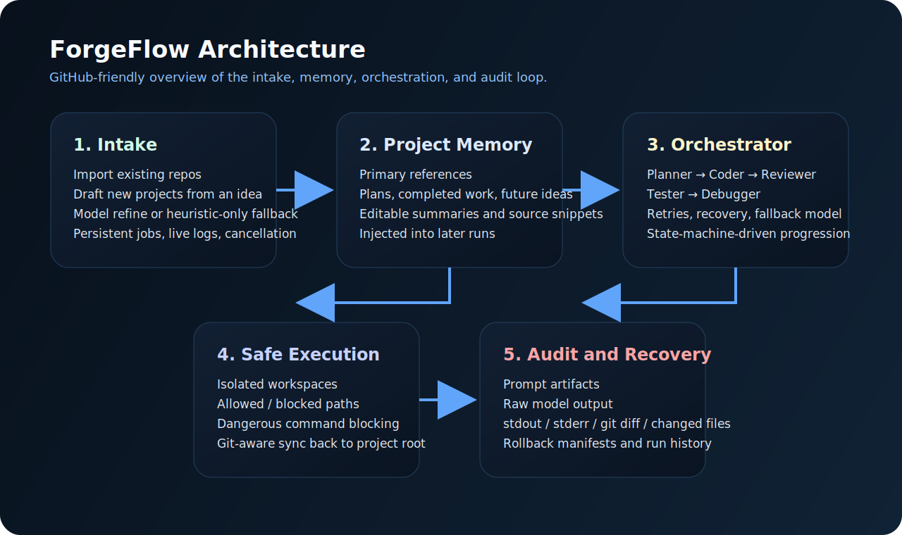
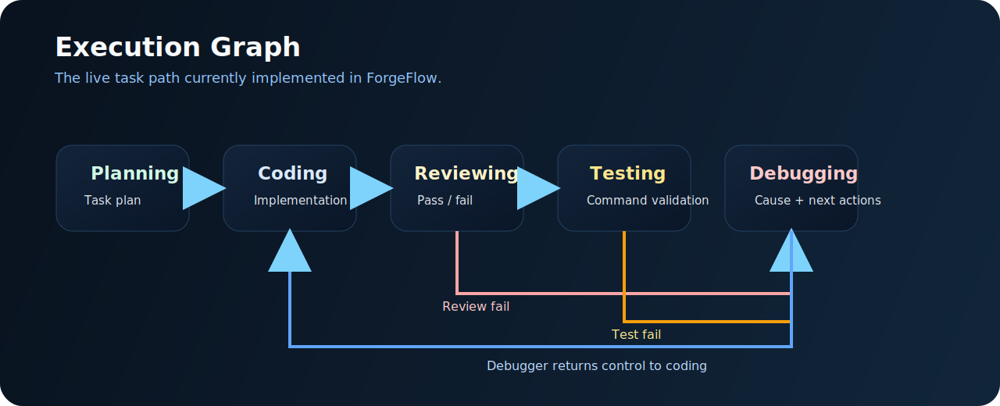

# ForgeFlow

<p align="right">
  <a href="./README.md"><strong>English</strong></a> |
  <a href="./README.zh-CN.md"><strong>简体中文</strong></a>
</p>

<p align="center">
  
</p>

<p align="center">
  <a href="https://github.com/Caesarcph/forgeflow/blob/main/LICENSE"></a>
  
  
  
</p>

ForgeFlow is a local-first multi-agent software delivery orchestrator.

It helps you import an existing codebase or start a new one, build a structured memory layer around docs and task sources, then run work through a staged agent execution graph with guardrails, audit artifacts, and rollback support.

## Why ForgeFlow

ForgeFlow is built for a practical problem: real projects do not start from a blank prompt.

They start from:

- a repository with uneven docs
- one or more TODO files
- historical planning notes
- commands that can break things
- partial context spread across Markdown

ForgeFlow turns that mess into a controllable workflow:

- intake and project understanding
- persistent project memory
- staged agent execution
- run-level audit trails
- isolated workspaces
- safe writeback and rollback

## Visual Overview

<p align="center">
  
</p>

<p align="center">
  
</p>

## Core Capabilities

| Capability | What it means |
| --- | --- |
| Existing-project intake | Import a repo, resolve TODO sources, summarize docs, and build project memory |
| New-project drafting | Start from an idea, generate starter docs, then confirm before execution |
| Persistent intake jobs | Long-running import and brainstorming jobs survive UI refreshes and support cancellation |
| Project memory | Primary docs, plans, future ideas, and TODO context are editable and injected later |
| Multi-stage orchestration | `planner -> coder -> reviewer -> tester -> debugger` with retries and recovery |
| Safe execution | Path boundaries, blocked commands, isolated workspaces, diff capture, and rollback |
| Auditability | Prompt artifacts, raw model output, stdout, stderr, git diff, and changed files per run |

## Monorepo Layout

```text
apps/
  api/     Fastify + Prisma backend
  web/     Next.js control plane
packages/
  core/                orchestration state machine and task logic
  db/                  Prisma helpers
  opencode-adapter/    local OpenCode CLI / HTTP executor adapter
  prompts/             default agent prompts
  task-parser/         Markdown task parser
  task-writeback/      checkbox writeback
docs/
  assets/
  troubleshooting.md
  known-issues.md
  release-readiness-checklist.md
  release-checklist.md
tests/
  focused unit and regression tests
```

## Current Status

ForgeFlow is currently an alpha-quality local developer tool.

What is already in place:

- existing-project and new-project intake
- persistent intake jobs with live logs
- PTY-backed local CLI health checks
- editable project memory
- staged execution with reviewer and debugger
- retries, recovery, fallback models, and run audit artifacts
- isolated execution workspaces
- git diff capture and rollback

What is still alpha:

- some OpenCode model and agent combinations still vary in structured-output reliability
- UI consistency is improving, but a few deeper flows still need cleanup
- packaging for non-developer desktop use is not finished
- broader end-to-end regression coverage is still being expanded

## Quick Start

### Requirements

- Node.js 22+
- pnpm 10+
- SQLite through Prisma
- OpenCode CLI installed locally if you want direct local execution

Optional:

- an OpenCode-compatible HTTP executor via `OPENCODE_BASE_URL`

### Install

```powershell
pnpm install
Copy-Item .env.example .env
pnpm db:push
pnpm dev
```

Default local addresses:

- Web UI: `http://localhost:3000`
- API: `http://127.0.0.1:4010`

## Environment

See [`.env.example`](./.env.example).

Important variables:

- `DATABASE_URL`
- `PORT`
- `NEXT_PUBLIC_API_BASE_URL`
- `OPENCODE_BASE_URL`
- `OPENCODE_API_KEY`
- `OPENCODE_CLI_PATH`
- `OPENCODE_CLI_TIMEOUT_MS`
- `OPENCODE_INTAKE_TIMEOUT_MS`
- `OPENCODE_HEALTHCHECK_TIMEOUT_MS`

## Typical Workflow

### Existing Project

1. Open ForgeFlow.
2. Run startup diagnostics if this is the first launch.
3. Choose `Existing Project`.
4. Enter the workspace root.
5. Choose intake strategy:
   - `Model Refine`
   - `Heuristic Only`
6. Optionally run model health checks.
7. Click `Inspect / Refine Import`.
8. Review resolved paths, TODO source, docs, scripts, and workspace layout.
9. Confirm import.
10. Run tasks from the project detail page.

### New Project

1. Choose `New Project`.
2. Enter the target root path.
3. Add project name and idea.
4. Add follow-up constraints if needed.
5. Click `Generate / Refine Draft`.
6. Review the generated starter files and project shape.
7. Confirm project creation.

Typical starter files:

- `README.md`
- `docs/project-brief.md`
- `docs/implementation-plan.md`
- `TODO.md`

## Execution Model

ForgeFlow runs project work through a staged graph:

```text
planning -> coding -> reviewing -> testing
                      |             |
                      +--> debugging +
```

Execution behavior includes:

- state-machine-driven transitions
- stage retries with backoff
- explicit recovery from planner, coder, or tester
- reviewer and debugger in the live path
- fallback model execution
- isolated workspaces before syncing changes back
- dangerous-command blocking
- changed-file validation against allowed and blocked paths
- git-aware diff capture and rollback artifacts

## Local CLI and HTTP Executor

ForgeFlow supports two execution modes.

### Local OpenCode CLI

If `OPENCODE_BASE_URL` is empty, ForgeFlow uses the locally installed OpenCode CLI.

This is the easiest mode for local experimentation.

### HTTP Executor

If `OPENCODE_BASE_URL` is set, ForgeFlow sends execution requests to an OpenCode-compatible HTTP executor.

This is useful if you want:

- centralized credentials
- remote execution
- a more controlled execution wrapper than local CLI behavior

## Useful Commands

```powershell
pnpm dev
pnpm build
pnpm exec turbo run typecheck
pnpm test:unit
pnpm db:push
pnpm db:generate
```

## Tests

The repository currently includes focused unit and regression coverage for:

- intake heuristics
- intake job state transitions
- project memory
- execution boundaries
- fallback model execution
- task writeback
- state machine behavior

Run them with:

```powershell
pnpm test:unit
```

## Docs

- [Troubleshooting](./docs/troubleshooting.md)
- [Known Issues](./docs/known-issues.md)
- [Release Readiness Checklist](./docs/release-readiness-checklist.md)
- [Release Checklist](./docs/release-checklist.md)
- [Roadmap TODO](./TODO.md)

## Contributing

This repository is prepared as a public local-developer tool. Contributions should keep safety, auditability, and deterministic fallbacks as first-class concerns.

- [Contributing Guide](./CONTRIBUTING.md)
- [Code of Conduct](./CODE_OF_CONDUCT.md)
- [License](./LICENSE)

## License

MIT
